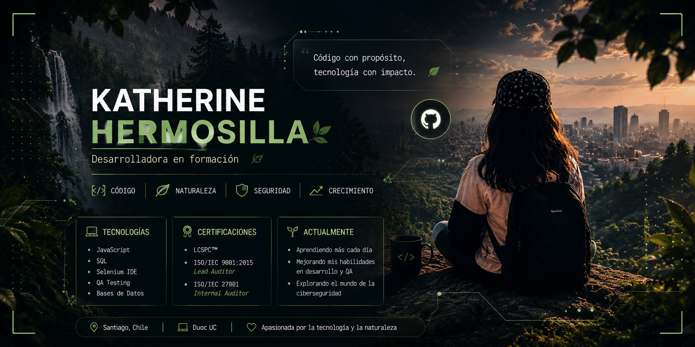

  

<h1 align="center">Hola 👋 Soy Katherine Hermosilla</h1>

💻 Estudiante de Ingeniería en Informática  
📈 Gestión de Proyectos TI • QA • Ciberseguridad  
🌿 Tecnología + naturaleza  
✨ Aprendiendo y creciendo constantemente

---

## 🌱 Sobre mí

* 🎓 Estudiante de Ingeniería Informática en Duoc UC
* 📈 Interesada en Gestión de Proyectos TI y tecnología
* 💡 Explorando QA, desarrollo y ciberseguridad
* 🚀 Apasionada por aprender nuevas herramientas
* 🤝 Responsable, organizada y proactiva
* 🌿 Inspirada por la creatividad y la naturaleza

---

## 🚀 Tecnologías

* JavaScript
* SQL
* Selenium IDE
* QA Testing
* Bases de Datos

---

## 🏅 Certificaciones

* LCSPC™ – Lead Cybersecurity Professional
* ISO/IEC 9001 Lead Auditor
* ISO/IEC 27001 Internal Auditor
* JavaScript Essentials 1
* Certificación en Calidad de Software

---

## 🌟 Actualmente

* 📈 Aprendiendo Gestión de Proyectos TI
* ☁️ Aprendiendo Microsoft Azure AZ-900
* 🔍 Explorando QA y automatización
* 🛡️ Fortaleciendo conocimientos en ciberseguridad
* ✨ Construyendo proyectos y creciendo cada día

---

  🌿 “Tecnología, organización e innovación para crear mejores proyectos.” 💻

